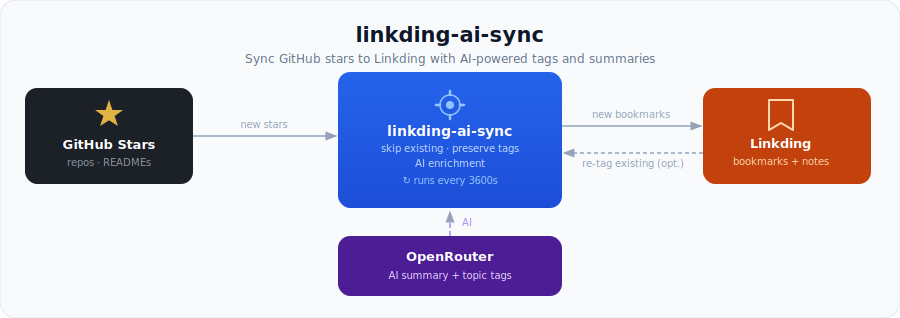

# Linkding AI Sync



`linkding-ai-sync` is a `uv`-managed Python service that:

- imports your GitHub stars into Linkding
- adds fixed source tags like `github` and `github-star`
- generates AI summaries and topical tags through OpenRouter
- can optionally AI-tag all existing Linkding bookmarks too

By default, a normal run:

- always syncs GitHub stars
- AI-tags newly imported GitHub stars
- skips GitHub repos that already exist in Linkding
- preserves existing tags and appends AI tags

## Quick start

### Local

1. Install `uv`.
2. Copy `.env.example` to `.env` and fill in your tokens.
3. Install dependencies:

```bash
uv sync
```

4. Run one sync:

```bash
uv run linkding-ai run-once
```

## Commands

Run a single sync, with GitHub-star AI tagging by default:

```bash
uv run linkding-ai run-once
```

Sync GitHub stars without AI:

```bash
uv run linkding-ai sync-github-stars --without-ai
```

AI-tag all existing Linkding bookmarks too:

```bash
uv run linkding-ai run-once --tag-scope all
```

Only sync GitHub stars and disable AI entirely:

```bash
uv run linkding-ai run-once --tag-scope none
```

Run only the bookmark-tagging pass:

```bash
uv run linkding-ai tag-bookmarks
```

Run the long-lived scheduler loop:

```bash
uv run linkding-ai serve
```

## Environment variables

Required for GitHub sync:

- `LINKDING_BASE_URL`
- `LINKDING_TOKEN`
- `GITHUB_TOKEN`

Required for AI tagging:

- `OPENROUTER_API_KEY`
- `OPENROUTER_MODEL`

Optional:

- `SYNC_INTERVAL`: seconds between scheduled runs in `serve` mode, default `3600`
- `AI_PROCESSED_TAG`: marker tag used to avoid reprocessing bookmarks, default `ai-tagged`
- `REQUEST_TIMEOUT`: HTTP timeout in seconds, default `30`
- `OPENROUTER_BASE_URL`: OpenRouter-compatible base URL, default `https://openrouter.ai/api/v1`
- `GITHUB_API_BASE_URL`: GitHub API base URL, default `https://api.github.com`
- `AI_SUMMARY_LABEL`: heading used inside the managed notes block, default `AI Summary`
- `USER_AGENT`: HTTP user agent sent to Linkding and GitHub, default `linkding-ai-sync/0.1.0`
- `OPENROUTER_APP_NAME`: app name sent to OpenRouter in headers, default `Linkding AI Sync`
- `OPENROUTER_SITE_URL`: optional site URL sent to OpenRouter as the `HTTP-Referer` header

Example `.env`:

```env
LINKDING_BASE_URL=https://linkding.yourdomain.com
LINKDING_TOKEN=your-linkding-token
GITHUB_TOKEN=your-github-token
OPENROUTER_API_KEY=your-openrouter-key
OPENROUTER_MODEL=openai/gpt-4.1-mini
SYNC_INTERVAL=3600
AI_PROCESSED_TAG=ai-tagged
REQUEST_TIMEOUT=30
```

## GitHub token permissions

The app reads your starred repositories and fetches each repository README for AI summaries. A fine-grained personal access token is the best fit.

Recommended GitHub fine-grained token setup:

- Resource owner: your personal account
- Repository access: `All repositories` for that owner
- User permissions: `Starring: Read`
- Repository permissions: `Contents: Read`

Notes:

- `Starring: Read` is needed to list your starred repositories.
- `Contents: Read` is needed to fetch repository READMEs, especially for private repositories.
- If you only care about public starred repositories, GitHub allows some of these endpoints to work without private-resource permissions, but the setup above is the safest default.
- If your private starred repositories span multiple owners or orgs, a fine-grained token can be more restrictive and may need broader planning than a single-owner setup.

## Server deployment with Docker Compose

1. Copy `.env.example` to `.env` and set the real values.
2. Build and start the service:

```bash
docker compose up -d --build
```

The container runs `linkding-ai serve`, which executes one sync cycle every `SYNC_INTERVAL` seconds.

To trigger a one-off run on the server:

```bash
docker compose run --rm app run-once
```

To process all bookmarks once:

```bash
docker compose run --rm app run-once --tag-scope all
```

## Notes behavior

AI summaries are written into a managed block inside Linkding `notes`. Manual notes are preserved. Existing tags are never removed; AI tags are appended and de-duplicated.

## Development

Run tests:

```bash
uv run --group dev pytest
```
